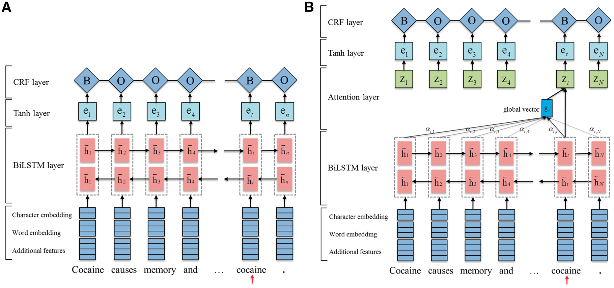

<base target="_blank" />

## LM

> transformer / elmo / Bert

1. [201706 - NIPS2017] [Attention Is All You Need](https://arxiv.org/abs/1706.03762)

    > [pytorch 版本](http://nlp.seas.harvard.edu/2018/04/03/attention.html)

## NER

> BiLSTM + crf / Lattice

1. [201508 - arXiv] [Bidirectional LSTM-CRF Models for Sequence Tagging](https://arxiv.org/abs/1508.01991)

1. [201603 - NAACL2016] [Neural Architectures for Named Entity Recognition](https://arxiv.org/abs/1603.01360)

1. [201805 - ACL2018] [Chinese NER Using Lattice LSTM](https://arxiv.org/abs/1805.02023)

## RC

## FewShot

1. [201810 - EMNLP2018] [FewRel: A Large-Scale Supervised Few-Shot Relation Classification Dataset with State-of-the-Art Evaluation](https://arxiv.org/abs/1810.10147)

1. [201904 - ICLR2019] [A Closer Look at Few-shot Classification
](https://arxiv.org/abs/1904.04232)

## img + KBR

> multi modal learning / vector

1. [Xie Ruobing 硕士论文] [融合多源信息的知识表示学习研究](http://nlp.csai.tsinghua.edu.cn/~lzy/thesis/2017_ruobing.pdf)

1. [201609 - IJCAI2017] [Image-embodied Knowledge Representation Learning](https://arxiv.org/abs/1609.07028)

1. [201902 - IEEE Journal] [Integrating Image-based and Knowledge-based Representation Learning](https://ieeexplore.ieee.org/abstract/document/8689107)

## other

[刘知远 page](http://nlp.csai.tsinghua.edu.cn/~lzy/)
